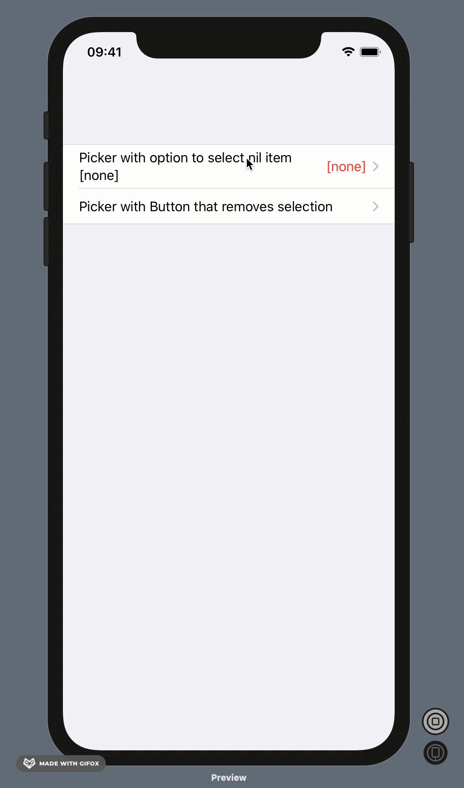
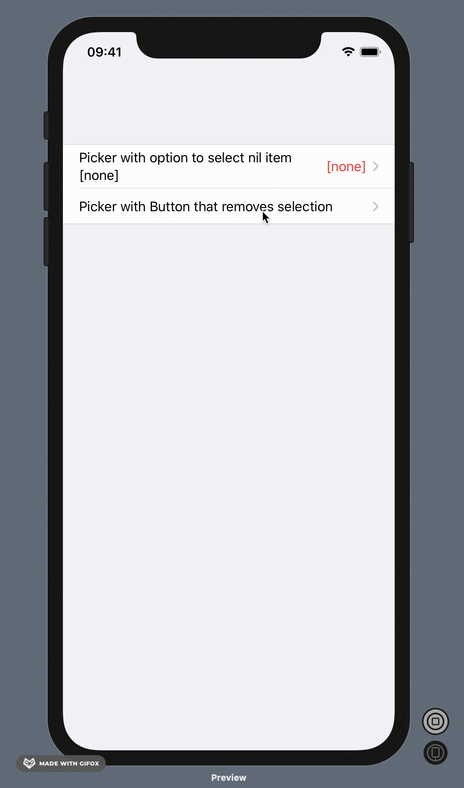

## Here are two options for a SwiftUI Picker with optional selection:

### 1. A "[none]" row that can be selected and sets the selection to nil.

### 2. A "Remove item" button that appears when something was selected; button action sets selection to nil.

The trick is to set the selection binding to optional, and cast the tags to optionals (of the same type as the selection binding).

--
Referenced answer from Senseful on Stack Overflow:
https://stackoverflow.com/questions/59348093/picker-for-optional-data-type-in-swiftui
